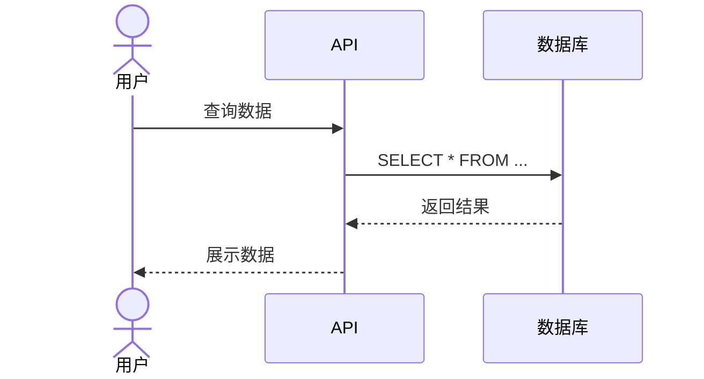

# 时序图生成器

将 Mermaid 时序图代码渲染为 PNG 图片。

## 使用方式

用户调用：
```
/sequence-diagram-generator
```

然后粘贴时序图代码。

## 执行流程

1. 接收用户粘贴的时序图代码
2. 调用 `scripts/generate.js` 脚本，使用 Kroki 在线服务生成 PNG
3. 保存图片到当前工作目录

## 辅助脚本

- `scripts/generate.js` - Node.js 生成脚本，使用 Kroki.io API
- `scripts/generate.sh` - Bash 备用脚本

## 技术方案

使用 **Kroki.io** 免费在线服务：
- 无需安装任何依赖
- 支持 Mermaid、PlantUML 等多种图表
- 生成速度快，质量高

备用方案：Mermaid Live Editor (https://mermaid.live/)

## 输出

- 格式：PNG
- 文件名：`sequence_YYYYMMDD_HHMMSS.png`
- 位置：当前工作目录

## 代码示例


